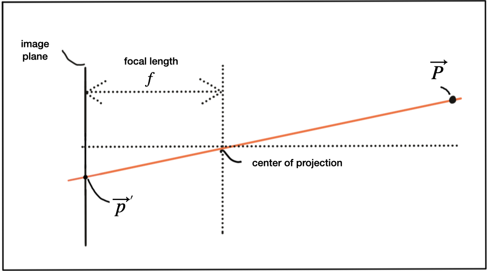

# Sensor Fusion NanoDegree- Camera Course
Camera is the second course in the Sensor Fusion ND. The purpose of this repo is to provide the exercise code to the students, so that they can practice in local system. 

This repo contains lesson-wise exercises and corresponding solutions for Udacity's Sensor Fusion ND.

# Lesson 2: Autonomous Vehicles and Computer Vision

## Levels of Autonomous Driving

Advanced Driver Assistance Systems (ADAS) provide assistance to drivers in various tasks but do not fully replace human control. They are a precursor to fully autonomous vehicles. Some vehicles on the market may imply full autonomy but are, in reality, advanced ADAS systems like Tesla's Autopilot. The transition to full autonomy involves significant technological and regulatory considerations.

<div style="text-align:center;">
    
</div>

## Autonomous Vehicle Sensors & Sensor Selection Criteria

The design of autonomous and Advanced Driver Assistance Systems (ADAS)-equipped vehicles involves the careful selection of sensors. The choice of sensors is crucial in achieving various levels of autonomy. Several key criteria play a significant role in this selection process:

1. **Range**: Lidar and radar systems can detect objects over various distances, while cameras have limitations in accurately measuring metric distances.

2. **Spatial Resolution**: Lidar provides high-resolution 3D scans, with radar's resolution diminishing as distances increase. Camera resolution depends on optics and lighting conditions.

3. **Robustness in Darkness**: Radar and Lidar excel in low-light conditions, while cameras rely on ambient light and perform less effectively at night.

4. **Robustness in Adverse Weather**: Radar is highly resilient in adverse weather conditions, whereas Lidar and cameras may be affected by factors like rain, snow, and fog.

5. **Classification of Objects**: Cameras excel at object classification, Lidar allows some level of classification, and radar offers limited classification capabilities.

6. **Perceiving 2D Structures**: Cameras can interpret two-dimensional information such as road signs, lane markings, and traffic lights.

7. **Measure Speed**: Radar can directly measure object velocity using the Doppler frequency shift, Lidar approximates speed using distance measurements, and cameras estimate time to collision by tracking object displacement.

8. **System Cost**: Radar and mono cameras are cost-effective, while stereo cameras are relatively more expensive. The cost of Lidar systems has decreased significantly in recent years.

9. **Package Size**: Radar and mono cameras can be integrated seamlessly into vehicles, whereas the size of stereo cameras can be bulky. Lidar systems come in various sizes, with a trend towards smaller solid-state Lidar systems.

10. **Computational Requirements**: Lidar and radar systems require less processing power, while cameras demand significant computational resources for extracting useful information from images.

These criteria guide the selection of sensors based on specific vehicle requirements and operational constraints. The choice of sensors significantly influences the capabilities of autonomous and ADAS systems.

| Sensor       | Range Measurement | Robustness in Darkness | Robustness in Rain, Snow, or Fog | Classification of Objects | Perceiving 2D Structures | Measure Speed / TTC | Package Size |
|--------------|-------------------|-------------------------|----------------------------------|--------------------------|------------------------|-------------------|--------------|
| Camera       | -                 | -                       | -                                | ++                       | ++                     | +                | +            |
| Radar        | ++                | ++                      | ++                               | -                        | -                      | ++               | +            |
| Lidar        | +                 | ++                      | +                                | +                        | -                      | +                | -            |

## Camera Technology Overview

### Pinhole Camera
The pinhole camera is a basic yet effective imaging device with a tiny opening (the pinhole) that allows light from an object to pass through and create an image on a photosensitive surface. The small size of the pinhole prevents image blurring caused by the superimposition of light rays from different parts of the object. This concept has been used for centuries, including by artists to create detailed portraits. In the pinhole camera setup, the photosensitive surface is the image plane, and the pinhole acts as the camera center. The distance between the camera center and the image plane is called the focal length (f). The 3D position of an object can be mapped to a point on the image plane by casting a beam through the center of projection, forming a correspondence between 3D and 2D coordinates. 

<div style="text-align:center;">
    
</div>

<div style="text-align:center;">
    
</div>

<div style="text-align:center;">
    
</div>

However, pinhole cameras have limitations, primarily the insufficient amount of light passing through the small opening. Widening the pinhole to increase light intake results in image blurring as rays from different parts of the object overlap. To overcome this issue, lenses are used to capture multiple rays of light originating from the same object point, which allows for brighter and less blurred images.

### Lenses and Aperture

Lenses are introduced as a solution to the limitation of pinhole cameras, providing the ability to capture more light and produce clearer images.

## A. List of Lesson-wise Exercises
1. Lesson 2: Autonomous Vehicles and Computer Vision
   - The OpenCV Library
1. Lesson 3: Engineering a Collision Detection System
   - Estimating TTC with Camera
   - Estimating TTC with Lidar
1. Lesson 4: Tracking Image Features
   - Descriptor Matching
   - Gradient-based vs. Binary Descriptors
   - Haris Corner Detection
   - Intensity Gradient and Filtering
   - Overview of Popular Keypoint Detectors
1. Lesson 5: Starter code for "Project: Camera Based 2D Feature Tracking" is available here - https://github.com/udacity/SFND_2D_Feature_Tracking
1. Lesson 6: Combining Camera and Lidar
   - Creating 3D-Objects
   - Lidar-to-Camera Point Projection
   - Object Detection with YOLO
1. Lesson 7: Starter code for "Project: Track an Object in 3D Space" is available here - https://github.com/udacity/SFND_3D_Object_Tracking


## B. Dependencies for Running Locally
1. cmake >= 2.8
    * All OSes: [click here for installation instructions](https://cmake.org/install/)


2. make >= 4.1 (Linux, Mac), 3.81 (Windows)
    * Linux: make is installed by default on most Linux distros
    * Mac: [install Xcode command line tools to get make](https://developer.apple.com/xcode/features/)
    * Windows: [Click here for installation instructions](http://gnuwin32.sourceforge.net/packages/make.htm)


3. OpenCV >= 4.1
    * This must be compiled from source using the `-D OPENCV_ENABLE_NONFREE=ON` cmake flag for testing the SIFT and SURF detectors.
    * The OpenCV 4.1.0 source code can be found [here](https://github.com/opencv/opencv/tree/4.1.0)


4. gcc/g++ >= 5.4 
    * Linux: gcc / g++ is installed by default on most Linux distros
    * Mac: same deal as make - [install Xcode command line tools](https://developer.apple.com/xcode/features/)
    * Windows: recommend using [MinGW](http://www.mingw.org/)


## C. Build Instructions
1. Fork this repo to your Github account
2. Clone your Github repo.
3. Go to the top level directory for an exercise, and run the following commands on your terminal:
```
mkdir build && cd build
cmake ..
make
./<Executable_File_Name>
```
4. Update back the remote (online) repo so that you can use the updated code in the classroom workspace. 

## D. Pushing Large Files (>100MB) [Optional]
The file `Combining Camera and Lidar/Object Detection with YOLO/detect_objects/dat/yolo/yolov3.weights` is 236.52 MB; this exceeds GitHub's file size limit of 100.00 MB

Github blocks the files that have size>100MB, while pushing them. To push large files, Git provides an option called Git Large File Storage (LFS). See the instructions at [https://git-lfs.github.com/](https://git-lfs.github.com/) to use Git LFS. See [http://git.io/iEPt8g](http://git.io/iEPt8g) for more information.

You can push large file only to unprotected remote branches. Master branch is by default protected. Read more [here](https://docs.github.com/en/github/administering-a-repository/about-protected-branches). Therefore, you'll have to push to a new unprotected branch, and later, merge it with the remote master. Use the commands below:

* Create a new local branch
```
git checkout -b <local_branch_name>
```

* Write the solution to your exercise. 

* Install Git Large File Storage (LFS). For MacOS, use
```
brew install git-lfs
git lfs install
git lfs track "<Large_file_name_if_any>"
git add .gitattributes
git add <path_to_the_Large_file_if_any>
git config --global lfs.contenttype 0

```

* Add the modified files to the index area, and commit the changes
```
git add . --all   
git commit -m "your comment"
```
* To push the current local branch and set the remote as upstream:
```
git push --set-upstream origin <local_branch_name>
```

* Next, create a PR and merge the new branch with the remote master.
	
